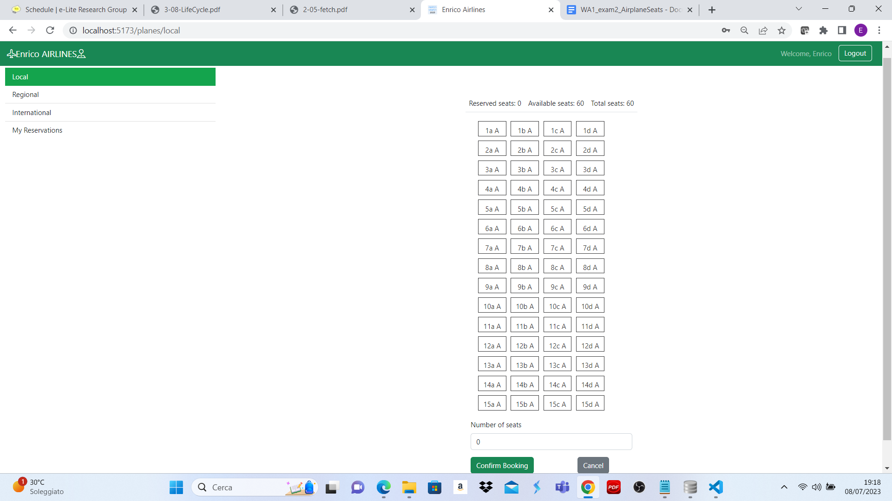

[](https://classroom.github.com/a/TsciYmrA)

# Exam #2: "Airplane Seats"
## Student: s317871 PISANTI ENRICO 

## React Client Application Routes

- Route `/`: This is the default route. It renders the DefaultLayout component, which includes the navigation and serves as the main layout for the application. From here, we can navigate to other routes and in particular the text "Please select a plane" is displayed.

- Route `/planes/:filterLabel` : This route is used for filtering airplanes based on a specific label. It renders the MainLayout component, which displays a table of airplanes. The filterLabel parameter in the URL is used to determine the filter applied to the airplanes. The available filters are "filter-local", "filter-regional", and "filter-international".

- Route  `/reservations/`:  This route is used for filtering reservations based on a specific user. It renders the ReservationLayout component, which displays a table of reservations for the logged users. We can "access" to this route only if the user is logged in otherwise we are redirecting to the login page.

- Route `/login`: This route has the purpose to show the login form.

- Route `*`: This route has the purpose to catch any path that has not been defined, it shows a page with a button that permits the user to come back to the root page.


## API Server

### Users APIs

#### POST `/api/sessions`

* Description: authenticate the user who is trying to login
* Request body: credentials of the user who is trying to login

``` JSON
{
    "username": "enrico@polito.it",
    "password": "enrico123"
}
```

* Response: `200 OK` (success)
* Response body: authenticated user

``` JSON
{
  "id": 1,
  "username": "enrico@polito.it",
  "name": "Enrico",
}
```

* Error responses:  `401 Unauthorized User` (login failed)


#### GET `/api/sessions/current`

* Description: verify if a user is still logged in
* Request body: _None_

* Response: `200 OK` (success)
* Response body: authenticated user

``` JSON
{
  "id": 1,
  "username": "enrico@polito.it",
  "name": "Enrico",
 
}
```

* Error responses:  `401 Not authenticated` (login failed)

#### DELETE `/api/session/current`

* Description: logout current user
* Request body: _None_
* Response: `200 OK` (success)

* Response body: _None_

* Error responses: `500 Internal Server Error` (generic error)


#### GET `api/users`

* Description: get the list of the name of the user in the db
* Request body: _None_

* Response: `200 OK` (success)
* Response body: list of the user

``` JSON
[
  "Enrico",
  "Diomede",
  "Giovanna",
  "Carmen"
]
```

* Error responses: `500 Internal Server Error` (generic error), `401 Unauthorized User` (user is not logged in or is not an admin)


### Reservation APIs

#### GET `api/reservations/<iduser>`

* Description: get the entire reservations of a given  logged user identified by a certain id.
* Request body: _None_

* Response: `200 OK` (success)
* Response body: An array of JSON object containing all 3 (or less)  reservations done by the user identified with the userid.

``` JSON
[
  {
  "idreservation": 1,
  "iduser": 2,
  "plane" : "local",
  "seat" : ["1A","1B","1C"]
  }

  {
  "idreservation": 4,
  "iduser": 2,
  "plane" : "regional",
  "seat" : ["1A","1B","1C"]
  }

  {
  "idreservation": 6,
  "iduser": 2,
  "plane" : "international",
  "seat" : ["1A","1B","1C"]
  }

]
```
* Error responses: `500 Internal Server Error` (generic error) ,`401 Unauthorized User`(user is not logged in and he is requesting all his reservations), `404 Not Found` (wrong id), `422 Unprocessable Entity` (validation error)

#### DELETE `api/reservations/<idreservation>`
* Description: A user can delete a reservation which is identified by a specific id
* Request body: _None_
* Response: `201 OK` (success)
* Response body: _None_
* Error responses: `500 Internal Server Error` (generic error), `422 Unprocessable Entity` (validation error), `404 Not Found` (wrong id), `401 Unauthorized User` (user is not logged)


#### POST `api/reservations/`
* Description: A user can insert a new reservation which is identified by a specific id
* Request body:
``` JSON
  {
    "iduser": 2,
    "plane" : 2,
    "seat" : ["1A"]
  }
```
* Response: `201 Created` (success)
* Response body: The object describing the reservation in the db:
``` JSON
  {
    "idreservation": 5,
    "iduser": 2,
    "plane" : 2,
    "seat" : ["1A"]
  }
```
* Error responses: `500 Internal Server Error` (generic error), `422 Unprocessable Entity` (validation error), `401 Unauthorized User` (user is not logged in/ normal user trying to create a new reservation), `406 Unavailable seats` (user is trying to reserved seats that are just booked ) 


### Airplane APIs

#### GET `/api/airplane/<airplanetype>`

* Description: Get the information needed to create the grid according to the airplanetype; infact according to the type of the airplane (local, regional, international) and according to the seats already occupied, the visulization of the grid change.
* Request body: _None_

* Response: `200 OK` (success)
* Response body: :

``` JSON

  {
  "typeplane" : "regional",
  "seatinrow": 5,
  "rowstot" : 20,
  "seat": ["1A","1B","1C"]
  },
 
```
* Error responses: `500 Internal Server Error` (generic error), `422 Unprocessable Entity` (validation error), `404 Not Found` (wrong airplanetype).


## Database Tables

Table `Planes` contains: 
- "idplane": an integer field representing the unique identifier of the plane.
- "typeplane": a text field indicating the type of the plane.
- "seatsinrow": an integer field representing the number of seats in a single row of the plane.
- "rowstot": an integer field indicating the total number of rows in the plane.

Table `Users` contain :

- "iduser": an integer field representing the unique identifier of the user.
- "username": a text field containing the username of the user.
- "email": a text field storing the email address of the user.
- "passwordhash": a text field containing the hash of the user's password.
- "passwordsalt": a text field containing the salt used for password encryption.


Table `Reservations`:

- "idreservation": an integer field representing the unique identifier of the reservation (auto-incremented).
- "iduser": an integer field indicating the user associated with the reservation.
- "plane": an integer field indicating the plane being reserved.

  A UNIQUE constraint on "iduser, plane" is done to ensure that a user can make only one reservation for a particular plane.
  A FOREIGN KEY constraints exists to link the "iduser" field to "iduser" in the "Users" table and the "plane" field to "idplane" in the "Planes" table.


Table `Reservedseats`:

- "reservation": an integer field representing the identifier of the reservation to which the seat is associated.
- "seat": a text field indicating the specific seat that is reserved.
- "idplane": Represents the ID of the plane on which the seat is reserved.

 Uniqueness constraint on the combination of the "seat" and "idplane" columns. This ensures that each seat on a specific plane can be reserved only once.
 Foreign key constraints are defined for the "reservation" and "idplane" columns, establishing relationships with respectively the "Reservations" and "Planes" tables. 

## Main React Components

- `LoginForm` (in `Auth.jsx`): contains the form to perform the login, the login button is inside of it

- `Navigation` (in `Navigations.jsx`): contains the navbar which has inside the buttons the login/logout button and the title of the site which, if clicked, allows us to return to the main page where we have to select a specific typology plane.

- `Seatbooking` (in `Airplane.jsx`): Seatreservation is a React component that handles seat reservations on a specific airplane. It takes care of displaying the details of the specific airplane, the seating grid, the booking form and the error or confirmation messages. It also manages user interaction with seats, allowing you to select or deselect desired seats and send a reservation to the server. 

- `ReservationLayout` (in `AirplaneLayout.jsx`): ReservationLayout is a React component that handles the display of user reservations in a table and providing the possibility to delete a specific reservation. It also manages the display of a confirmation message after deleting a reservation. 

- `ReservationTable` and `ReservationRow` (in `Reservation.jsx`): those two components are used together to show the reservations in a table that is made of the following fields: reservation ID, plane, seats reserved.

- `RouteFilters` (in `Filters.jsx`): The RouteFilters function is a component that displays a list of filters as clickable links. Filters are defined through an object with their name, label and corresponding URL. The function converts the filter object into an array and creates a list of links using the information from the array. Each link represents a filter and displays the associated label. By clicking on a link, the user can activate the corresponding filter. Finally, the component returns the filter list, displayed as a list of clickable links.


## Screenshot

A screenshot of the screen for booking the seats



## Users Credentials

- email: "enrico@polito.it" pwd: "enrico123", username: "Enrico"
- email: "diomede@libero.it", pwd: "napoli123", username: "Diomede" 
- email: "giovanna@example.com", pwd: "farmacia2023", username: "Giovanna" 
- email: "carmen@luiss.it", pwd:"luiss678", username: "Carmen"


